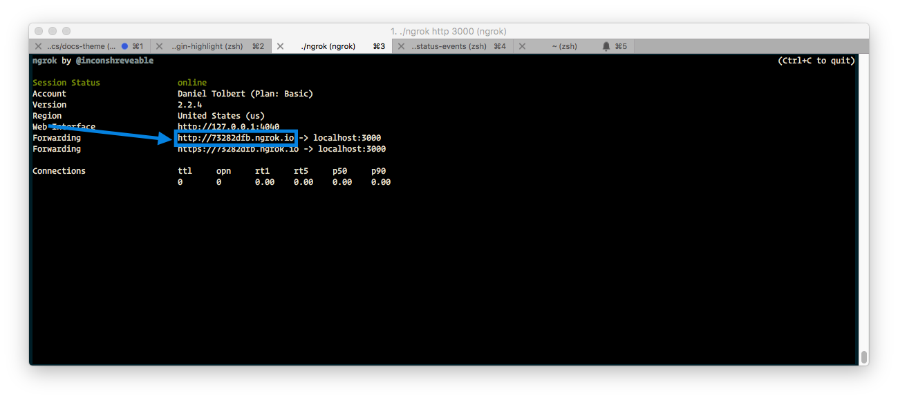
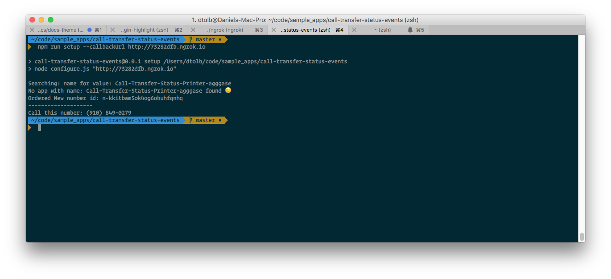
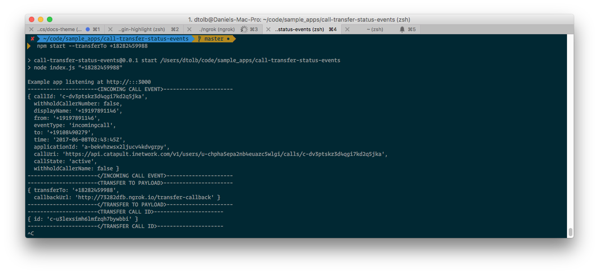

# call-transfer-status-events

## Pre-reqs

* Ngrok or some local tunnel
* Bandwidth account
* Env Vars:
	* `BANDWIDTH_USER_ID`
	* `BANDWIDTH_API_TOKEN`
	* `BANDWIDTH_API_SECRET`

## Setup

### Install all the dependecies
`npm install`

### Run ngrok or whatever your local tunnel maybe

`./ngrok http 3000`

### Run the `setup` command
Then run the setup with the ngrok domain as the value `callbackUrl`.

`npm run setup --callbackUrl http://73282dfb.ngrok.io`

The setup command will:

* Look for any pre-existing Bandwidth applications with the name
* If found:
	* Update the `callbackUrl` to the value passed (if it's not already correct)
	* Look for any phone numbers associated with the applcation
	* If no number is found, will order and associate a new number
* If not found:
	* Create an application with the `callbackUrl`
	* Order new number and associate with the new application
* Tell you the number to call

### Run the application with a transfer number

Finally, run the application with the desired phone number to transfer to:

`npm start --transferTo +18282459988`

Once the application is running, call the number from the `setup` command and it will forward to the `transferTo` number. It will also print all events that happen on the call.

